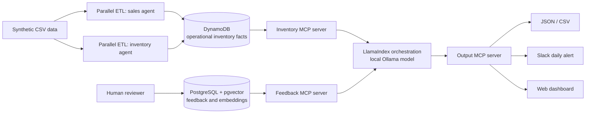

# Grocery Intelligence Agent — Project Brief

## Product summary

Build a portfolio-grade, zero-recurring-cost AI business-intelligence system for a retail grocery chain. The first release optimizes inventory: it detects slow-moving SKUs, recommends reorder points, and proposes clearance actions. Later work can add customer-churn analysis without changing the core platform.

The differentiators are deliberately visible in the product:

- Concise, evidence-backed **business intelligence briefings** written for a store or merchandising leader rather than for an engineer.
- A **human feedback loop**: users critique recommendations; the system retrieves relevant prior feedback on later runs and adjusts its reasoning. This is retrieval/prompt memory, not model training.

### Team ownership

| Builder | Primary responsibility |
| --- | --- |
| Srivatsan Rangarajan ([@Sriva29](https://github.com/Sriva29)) | Agent logic, LlamaIndex orchestration, MCP servers, structured recommendations, and evaluation |
| Beula ([@BeulaEvangelin](https://github.com/BeulaEvangelin)) | DynamoDB and PostgreSQL/pgvector, ETL, data quality, Slack, and dashboard integrations |

### Scope guardrails

- Phase 1 uses synthetic, non-sensitive data only. Do not ingest customer PII.
- “Confidence” means an explainable heuristic score based on data completeness, signal strength, and feedback agreement—not a claim of calibrated model probability.
- The default model path is local Ollama. Claude is an optional, manually enabled final-writing adapter only; it is excluded from the zero-cost demo path.
- Treat cloud free tiers as quotas, not guarantees. Add budget alerts and keep a local Docker fallback for every stateful dependency.

## Architecture overview



### Component responsibilities

| Component | Purpose | Zero-cost default |
| --- | --- | --- |
| DynamoDB | Operational reads for SKU/store inventory and daily sales aggregates | DynamoDB Local for development; AWS DynamoDB only within the active free allowance for the demo |
| PostgreSQL + pgvector | Feedback records, embedding vectors, evaluation outcomes | Local Docker Compose service |
| LlamaIndex | Tool-using agent workflow, retrieval integration, prompt assembly | Python package running locally |
| Ollama | Local inference and local embedding model | Ollama on a developer machine |
| MCP servers | Narrow interfaces for inventory, feedback, and outputs | Local stdio servers first; HTTP only when an integration needs it |
| Parallel ETL | Independently validates/loads sales and inventory source files, then reports a combined run result | Python async/process-based jobs, coordinated by a small ETL runner |
| Slack / dashboard | Human-facing distribution and review | Slack Free workspace and a locally hosted dashboard |

### Recommendation contract

Every recommendation should be a structured record before it becomes prose:

```json
{
  "recommendation_id": "uuid",
  "run_id": "uuid",
  "store_id": "S001",
  "sku_id": "SKU-123",
  "type": "slow_mover|reorder|clearance",
  "action": "...",
  "evidence": {"units_sold_28d": 4, "days_of_supply": 92},
  "reasoning": ["..."],
  "confidence": 0.78,
  "confidence_factors": ["28 days of complete sales history", "low sales velocity"],
  "status": "new|reviewed|accepted|rejected",
  "created_at": "ISO-8601"
}
```

Use deterministic calculations for sales velocity, days of supply, reorder point, and clearance eligibility. The LLM should explain, prioritize, and phrase recommendations—not invent the numeric basis.

## Recommended GitHub workflow

- Protect `main`; merge via pull request after one teammate review where practical. Keep it runnable at every merge.
- Use short-lived branches named `feat/<issue>-<slug>`, `fix/<issue>-<slug>`, or `docs/<issue>-<slug>`.
- Create an issue for every task that can be independently reviewed. Label by `phase:1` through `phase:4`, `area:agent`, `area:data`, `area:integration`, and `type:chore|feature|bug`.
- Use a GitHub Project board with **Backlog → Ready → In progress → Review → Done**. Assign exactly one owner; link each pull request to its issue.
- PR template: goal, screenshots/sample output where relevant, tests run, data/schema changes, and rollback notes. Avoid committing `.env`, model files, credentials, or production-like data.
- Add a lightweight architecture decision record for consequential choices: `docs/adr/NNNN-title.md`.
- Tag end-of-phase demos (`v0.1-mvp`, `v0.2-feedback`, etc.) and record a two-minute demo script in the release notes.

## Target repository structure

```text
.
├── README.md
├── PROJECT_BRIEF.md
├── .env.example
├── docker-compose.yml
├── Makefile / scripts/
├── docs/
│   ├── adr/
│   ├── data-dictionary.md
│   ├── evaluation-plan.md
│   └── demo-script.md
├── infra/
│   ├── dynamodb/
│   └── postgres/
├── data/
│   ├── raw/                 # ignored except small fixtures
│   ├── fixtures/
│   └── generated/
├── apps/
│   ├── api/                 # dashboard/API backend when introduced
│   └── dashboard/           # simple web client when introduced
├── services/
│   ├── agent/
│   │   ├── workflows/
│   │   ├── prompts/
│   │   ├── policies/
│   │   └── evaluation/
│   ├── etl/
│   │   ├── sales_loader.py
│   │   ├── inventory_loader.py
│   │   └── run_parallel.py
│   └── mcp/
│       ├── inventory_server/
│       ├── feedback_server/
│       └── output_server/
├── packages/
│   └── shared/              # schemas, calculators, typed contracts
└── tests/
    ├── unit/
    ├── integration/
    └── fixtures/
```

Keep shared request/response schemas in `packages/shared`; do not duplicate DynamoDB record shapes in agent, ETL, and dashboard code.

---

# Phase 1 — Core infrastructure and agent MVP

## Goals

Establish a reproducible local development environment; load grocery inventory/sales data into DynamoDB; and generate validated slow-mover, reorder-point, and clearance recommendations as JSON and CSV. No Slack, dashboard, or feedback retrieval yet.

## Srivatsan — agent logic, MCP, orchestration

- [ ] Define versioned Pydantic/JSON schemas for `InventorySnapshot`, `SalesDaily`, `Recommendation`, `RunMetadata`, and calculation inputs/outputs in `packages/shared`.
- [ ] Build the Inventory MCP server with read-only tools: `get_sku_inventory`, `get_sales_history`, `list_store_skus`, and `get_data_freshness`. Require explicit store/SKU/date-window inputs and return typed results.
- [ ] Implement a LlamaIndex workflow that: requests data through MCP, runs deterministic calculators, ranks results, and calls Ollama only to compose concise explanation fields.
- [ ] Implement deterministic inventory rules with configurable parameters: slow-moving threshold, lookback window, lead time, safety stock/service-level assumption, minimum stock, clearance aging threshold, and markdown bands.
- [ ] Add prompt guardrails: never fabricate metrics, cite the supplied evidence fields, distinguish insufficient data from a negative finding, and emit a JSON-valid structured result before CSV rendering.
- [ ] Add an `agent run` CLI accepting `--store`, `--as-of-date`, and `--output-dir`; write `recommendations.json`, `recommendations.csv`, and `run-metadata.json`.
- [ ] Unit-test calculators and schema validation; add at least one agent integration test using fixtures and a mocked model response.

## Beula — data infrastructure and ETL

- [ ] Write the data dictionary and source-file contracts for SKU master, inventory snapshots, and daily sales. Include required columns, allowed nulls, units, dates, and quality checks.
- [ ] Design and provision DynamoDB Local schema plus infrastructure definition for the optional AWS demo table.
- [ ] Use a single-table design only where the access patterns stay clear. Recommended keys:
  - `PK=STORE#{store_id}`, `SK=SKU#{sku_id}` for current inventory state.
  - `PK=STORE#{store_id}#SKU#{sku_id}`, `SK=SALES#{yyyy-mm-dd}` for sales history.
  - GSI1: `GSI1PK=SKU#{sku_id}`, `GSI1SK=STORE#{store_id}` for chain-wide SKU lookup.
  - Add `entity_type`, `updated_at`, `schema_version`, and data-quality fields to every item.
- [ ] Implement independent `sales_loader` and `inventory_loader` jobs. Coordinate them in `run_parallel.py`; fail the run if either source is invalid, and persist a load manifest with counts and freshness.
- [ ] Supply Docker Compose for DynamoDB Local and PostgreSQL/pgvector (PostgreSQL is initialized now but unused by the agent in this phase).
- [ ] Generate a compact synthetic fixture set with normal, slow-moving, out-of-stock, seasonal, and malformed-row cases. Do not commit large generated datasets.
- [ ] Document local setup, environment variables, reset/seed commands, and optional AWS table deployment commands.

## Dependencies and handoffs

1. Agree on shared schemas and calculator parameter names before either implementation begins (Srivatsan + Beula).
2. Beula publishes fixture CSVs, Dynamo access patterns, and load manifest contract; Srivatsan can then build MCP tool contracts against those fixtures.
3. Srivatsan provides exact read patterns and projected attributes; Beula confirms the DynamoDB design serves them without scans for normal agent runs.
4. Beula’s seeded dataset and Srivatsan’s structured-result contract are required before end-to-end acceptance.

## Acceptance criteria — done when

- `docker compose up` plus one documented seed command creates usable local DynamoDB and PostgreSQL/pgvector services from a clean clone.
- The parallel ETL run loads both sales and inventory fixtures, writes a manifest, and rejects invalid data with actionable errors.
- A command for a selected store produces schema-valid JSON and CSV recommendations without a paid API key.
- Given the fixtures, the output correctly flags known slow movers, calculates expected reorder points from documented assumptions, and proposes clearance only for qualifying inventory.
- Every recommendation contains evidence, confidence, confidence factors, and an explicit data-insufficient outcome where appropriate.
- Unit tests cover calculation boundaries; one integration test exercises ETL → DynamoDB → MCP → agent → output.

## Tech checklist

- [ ] Python 3.11+ and isolated dependency management
- [ ] Docker/Docker Compose
- [ ] DynamoDB Local + AWS CLI profile only if demonstrating AWS
- [ ] PostgreSQL image with pgvector enabled
- [ ] Ollama installed; a small local chat model and embedding model pulled and documented
- [ ] LlamaIndex and MCP Python SDK pinned in lockfile
- [ ] `.env.example`, secret-safe configuration, logging, and test commands

## Free-tier setup notes and gotchas

- DynamoDB Local makes development truly free and removes surprise cloud charges. If using AWS for a portfolio demo, set a small monthly budget alert, configure TTL for disposable run data, and delete demo resources afterward.
- AWS free-tier terms and account offers can change; verify the current DynamoDB allowance in the AWS Billing console before provisioning. Do not assume the first-year allowance is permanent.
- Ollama needs local RAM/disk. Start with a small instruct model; make model name configurable and use deterministic calculators so model quality does not control correctness.
- DynamoDB Local does not replicate every cloud behavior (IAM, throughput behavior, backups). Keep a short cloud smoke-test checklist if AWS is listed on the portfolio.

## Phase-specific folders

```text
infra/dynamodb/      services/etl/       services/mcp/inventory_server/
services/agent/      packages/shared/    tests/{unit,integration}/
data/fixtures/       docs/{adr,data-dictionary.md}
```

---

# Phase 2 — Feedback loop and retrieval-augmented improvement

## Goals

Capture human judgment on each recommendation, embed that feedback in pgvector, retrieve relevant prior feedback for future agent runs, and prove that retrieved feedback materially improves recommendation quality on a held-out evaluation set.

## Srivatsan — agent logic, MCP, orchestration

- [ ] Define the feedback-aware run policy: retrieve before final explanation/ranking; use feedback as advisory context; never override current numeric evidence solely because of a past comment.
- [ ] Build the Feedback MCP server tools: `submit_feedback`, `search_similar_feedback`, `get_recommendation_feedback`, and `record_evaluation`.
- [ ] Add a local embedding adapter (Ollama embedding model) and LlamaIndex retriever with metadata filters for recommendation type, store/region when available, SKU category, feedback outcome, and recency.
- [ ] Extend prompt/context assembly to include a bounded set of retrieved examples, their outcomes, and a clear instruction to explain whether feedback altered prioritization or wording.
- [ ] Create a feedback-influence trace in the output: retrieved feedback IDs, relevance scores, applied/not-applied decision, and reason. Never expose private reviewer identities in UI output.
- [ ] Create a regression/evaluation harness comparing baseline vs. feedback-aware output on a frozen, labelled scenario set. Define metrics before tuning prompts.
- [ ] Add adversarial tests: irrelevant feedback, contradictory feedback, a single reviewer’s repeated preference, stale feedback, and feedback asking the model to ignore evidence.

## Beula — data infrastructure and feedback ingestion

- [ ] Create PostgreSQL migrations for `recommendations`, `feedback`, `feedback_embeddings`, `agent_runs`, and `evaluation_results`; use UUID keys and foreign keys to recommendation/run records.
- [ ] Enable pgvector and create a vector index appropriate to the chosen embedding dimension and expected local data volume.
- [ ] Implement feedback capture initially as a CLI or small API endpoint with: accept/reject, 1–5 usefulness score, corrected action, optional rationale, reviewer role, and timestamp.
- [ ] Validate and sanitize input; version embeddings and prompts so old records remain interpretable after model changes.
- [ ] Implement asynchronous embedding after feedback submission, with a retryable pending state. Retrieval must filter out records without a completed embedding.
- [ ] Add seed feedback that represents realistic merchandising judgment, including both useful corrections and intentionally irrelevant examples.
- [ ] Provide backup/restore scripts for local PostgreSQL and integration tests for migration, vector insertion, filtered search, and deletion/update behavior.

## Dependencies and handoffs

1. Phase 1 recommendation IDs and evidence schema must be stable enough to reference from feedback.
2. Srivatsan defines retrieval metadata and evaluation labels; Beula implements columns, indexes, and filtered-query support.
3. Beula provides seeded feedback and deterministic retrieval fixtures; Srivatsan supplies the evaluation harness and prompt policy.
4. Both agree on a small labelled set of “better after feedback” cases before claiming improvement.

## Acceptance criteria — done when

- A reviewer can submit feedback for an existing recommendation and see it stored with valid linkage, embedding status, and audit metadata.
- Similar feedback is retrieved semantically with required metadata filters; unrelated or stale feedback is excluded by test cases.
- A feedback-aware run records exactly which feedback was retrieved and how it affected (or did not affect) the result.
- On the agreed held-out evaluation set, feedback-aware runs improve a predefined metric (for example, accepted top-3 recommendations or reviewer usefulness rating) over the baseline without degrading numeric correctness.
- The project can demonstrate at least one before/after scenario with a transparent explanation of the improvement.

## Tech checklist

- [ ] pgvector extension and migration runner
- [ ] Local embedding model through Ollama, model/dimension version recorded
- [ ] Feedback API/CLI contract plus validation
- [ ] Metadata-filtered similarity query and vector index
- [ ] Evaluation fixtures, baseline snapshot, and measurable success threshold
- [ ] Data-retention/deletion command for locally entered feedback

## Free-tier setup notes and gotchas

- Run PostgreSQL + pgvector locally in Docker by default. A hosted free Postgres option is convenient but can sleep, expire, change limits, or require a card; it is not necessary for the core demo.
- Embedding text needs normalization and a size limit. Avoid embedding raw operational dumps; embed the feedback plus a compact recommendation context.
- “Improves” needs a frozen test set. Otherwise the team can accidentally tune prompts to anecdotes and mistake that for learning.

## Phase-specific folders

```text
infra/postgres/migrations/   services/mcp/feedback_server/
services/agent/evaluation/   services/agent/policies/
tests/fixtures/feedback/     docs/evaluation-plan.md
```

---

# Phase 3 — Narrative briefings and integrations

## Goals

Turn structured recommendations into clear daily briefings, distribute a succinct alert to Slack, and provide a small dashboard for browsing recommendations, evidence, reasoning, confidence, and feedback.

## Srivatsan — agent logic, MCP, orchestration

- [ ] Create a briefing-generation workflow that groups recommendations into: urgent stock risk, slow-moving/clearance opportunities, and watch list. It must be grounded in the structured records generated earlier.
- [ ] Define a narrative style guide: executive voice, headline first, specific action/owner/timeframe, evidence in plain language, uncertainty disclosed, no invented financial impact.
- [ ] Add narrative quality checks: all cited SKU counts/actions match the source records; no unsupported claims; output has a max length for Slack and a fuller dashboard version.
- [ ] Extend Output MCP server with `publish_slack_summary`, `write_briefing`, and `export_sheet` (the last is optional and feature-flagged).
- [ ] Implement a scheduled orchestration entry point that is idempotent by store/date, prevents duplicate Slack publication, and captures run status.
- [ ] Add a sparse optional Claude final-synthesis adapter behind `ENABLE_CLAUDE=false` by default, including hard token limits and a local-model fallback. It must never be required by tests or demos.

## Beula — integrations and dashboard

- [ ] Create a Slack app/webhook for a dedicated demo channel; store webhook/token only in environment configuration. Format alerts with top actions, confidence, and a dashboard link.
- [ ] Build a minimal dashboard (for example FastAPI + server-rendered pages, or a small React/Vite client backed by FastAPI). Favor a fast, maintainable stack over polished animation.
- [ ] Dashboard views: daily briefing, recommendation list/filter, recommendation detail (evidence, reasoning, confidence factors, feedback influence), and feedback form.
- [ ] Add API read models/endpoints for runs, recommendations, and feedback submission. Enforce local/demo-only access assumptions explicitly; do not imply production authentication exists.
- [ ] Implement a local scheduler path (manual CLI plus OS scheduler instructions) rather than a paid always-on host. Add Slack delivery failure logs/retry guidance.
- [ ] Add optional Google Sheets CSV export first; only implement direct Sheets API writing if the team has a credential-free or explicitly approved demo path.
- [ ] Add lightweight UI and integration tests, plus screenshots/GIFs for README/demo use.

## Dependencies and handoffs

1. Phases 1–2 must expose stable recommendation, feedback trace, and run-status schemas.
2. Srivatsan supplies the briefing contract and output events; Beula supplies Slack/dashboard endpoint contracts and URLs.
3. Beula’s feedback UI reuses Phase 2 validation and API—not a separate storage route.
4. Srivatsan owns content correctness; Beula owns delivery/display correctness. Review a shared end-to-end demo before merging.

## Acceptance criteria — done when

- One command creates a narrative briefing from a completed run, and every stated action can be traced to a structured recommendation/evidence record.
- A scheduled or manually invoked daily run posts one readable Slack alert to the configured demo channel, without duplicate posts on re-run.
- The local dashboard displays daily briefing, individual recommendations, evidence, reasoning, confidence factors, feedback influence, and feedback submission.
- A reviewer can follow a Slack link to a recommendation and submit feedback that appears in the Phase 2 retrieval store.
- The entire demo works with Ollama and local services only; the Claude path is demonstrably optional and disabled by default.

## Tech checklist

- [ ] Briefing schema/style guide and grounding tests
- [ ] Slack app/webhook, least-privilege scopes, local `.env` setup
- [ ] Dashboard/API stack, health endpoint, and local start command
- [ ] Idempotency key: `store_id + business_date + briefing_version`
- [ ] Error logging for model, Slack, and database failures
- [ ] Optional CSV/Google Sheets export feature flag
- [ ] Screenshots and end-to-end smoke test

## Free-tier setup notes and gotchas

- Slack Free is suitable for a demo channel, but its history/retention and app features can be limited. Keep canonical results in DynamoDB/PostgreSQL, not Slack.
- A local dashboard avoids hosting costs. If deployed later, use a provider only after confirming its current free-tier sleep, credit-card, and data-retention rules.
- Do not run a paid LLM as an unattended daily job. Claude must remain opt-in, capped, and clearly labeled in run metadata.
- Google Sheets API setup adds OAuth/service-account complexity. CSV export is the honest MVP and keeps the demo portable.

## Phase-specific folders

```text
apps/api/               apps/dashboard/        services/mcp/output_server/
services/agent/prompts/ services/agent/workflows/  docs/demo-script.md
tests/integration/slack/ tests/ui/
```

---

# Phase 4 — Polish and showcase

## Goals

Make the project easy to run, credible to review, visually demonstrable, and resilient under a realistic synthetic workload. Package the story as an engineering portfolio piece, not merely a prototype.

## Srivatsan — agent quality and technical narrative

- [ ] Expand the synthetic scenario/evaluation set: regular movers, slow movers, demand spikes, stockouts, supplier lead-time changes, promotions, seasonal products, and conflicting reviewer feedback.
- [ ] Tune prompts and deterministic ranking only against the frozen evaluation plan; document trade-offs and regression results.
- [ ] Add observability fields: run duration, tool-call counts, model name/version, prompt version, retrieved-feedback count, failures, and output validation status.
- [ ] Produce an architecture walkthrough and a short narrated demo script explaining MCP boundaries, parallel ETL, deterministic calculations, local AI, and feedback retrieval.
- [ ] Write ADRs for DynamoDB design, pgvector/RAG approach, confidence semantics, local-first model decision, and optional paid-synthesis boundary.
- [ ] Identify the churn-analysis extension seams (data contracts, tools, recommendation types) and document them without implementing churn scope.

## Beula — performance, reliability, and portfolio packaging

- [ ] Generate reproducible, seeded synthetic datasets at several sizes; include a data generator and scenario manifest rather than committing huge files.
- [ ] Benchmark ETL, DynamoDB reads, vector retrieval, agent run, and dashboard load. Capture baseline results and address the largest obvious bottleneck.
- [ ] Add CI for lint, unit tests, integration tests using Docker services, schema/migration checks, and a small end-to-end smoke test. Keep model-dependent tests optional or mocked so CI is free and stable.
- [ ] Harden local developer experience: one-command bootstrap, seed/reset, sample run, dashboard start, and teardown; verify fresh-clone instructions on a second machine/account if possible.
- [ ] Create portfolio assets: polished README, architecture diagram, screenshots, 2–3 sample briefings, GIF/short video, and known limitations section.
- [ ] Review credentials, `.gitignore`, logs, and datasets for accidental secrets or sensitive-style data; add dependency/license notices.

## Dependencies and handoffs

1. Phase 3’s end-to-end path must be stable before performance work; benchmark a tagged baseline.
2. Srivatsan defines evaluation and portfolio story; Beula makes the runnable demo, CI, and performance claims reproducible.
3. Both conduct a fresh-clone demo rehearsal and record every manual step as either documentation or an issue.

## Acceptance criteria — done when

- A new reviewer can clone the repository, follow the README, seed data, run the agent, open the dashboard, and view a Slack/demo output without paid services.
- The README clearly distinguishes local-only MVP behavior, optional AWS/Claude paths, assumptions, architecture, evaluation evidence, and limitations.
- CI passes on pull requests without requiring an Ollama model, cloud credentials, or paid API keys.
- A reproducible benchmark reports dataset size, machine assumptions, timing, and any remaining bottleneck.
- The demo includes realistic examples showing slow movers, reorder decisions, clearance actions, a feedback-influenced change, and an insufficient-data case.
- The repository contains no secrets, personal data, or unlicensed datasets/model artifacts.

## Tech checklist

- [ ] Seeded synthetic-data generator and scenario catalogue
- [ ] Benchmark script and result artifact
- [ ] GitHub Actions CI with Dockerized service tests
- [ ] Linters, formatters, type checks, and dependency lockfiles
- [ ] README, ADRs, data dictionary, evaluation plan, demo script
- [ ] Screenshots/video and accessibility pass for dashboard basics
- [ ] Security/secret scan and license review

## Free-tier setup notes and gotchas

- GitHub Actions has plan-specific usage limits; keep CI bounded, cache cautiously, and avoid pulling multi-gigabyte Ollama models in CI.
- Synthetic-data generators should use fixed seeds so screenshots, tests, and benchmark comparisons do not drift.
- A local-first demo is the strongest zero-cost story. Cloud deployment is a bonus, not a dependency; document teardown steps to prevent accidental billing.

## Phase-specific folders

```text
scripts/                  data/generated/       docs/adr/
docs/benchmarks/          .github/workflows/    tests/e2e/
```

---

## Out of scope until after Phase 4

- Customer churn prediction/segmentation and any customer-level data ingestion.
- Model fine-tuning or retraining from feedback.
- Production multi-tenant authentication, role-based access control, high availability, or guaranteed real-time data.
- Automated price changes, purchase orders, or other write actions against retail systems. The system recommends; humans decide.

## Suggested first sprint (one week)

1. Create GitHub issues from Phase 1 and agree on shared schemas, calculation assumptions, and fixture columns.
2. B ships Compose, fixtures, the parallel ETL skeleton, and DynamoDB access-pattern document.
3. A ships typed recommendation contract, deterministic calculator functions, and Inventory MCP stub over fixtures.
4. Pair on the first end-to-end local run; then replace fixture reads with DynamoDB reads and lock in a regression test.

The best early demo is deliberately modest: “For Store S001, here are three slow-moving products, two reorder risks, what the evidence says, and what action a manager should take.” Make that completely trustworthy before teaching it to sound clever.
